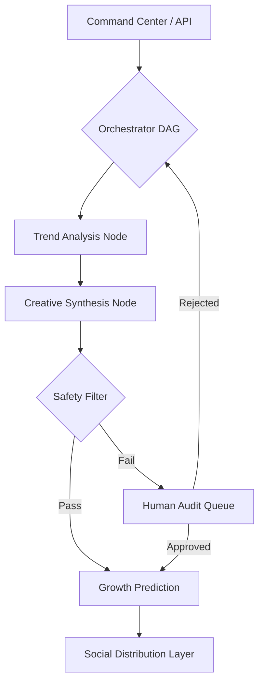

# 🦂 Mantis AI

> **The next-generation orchestration engine for algorithmic social distribution. Built for the era of agentic intelligence.**

[](https://opensource.org/licenses/MIT)
[](https://www.python.org/)
[](https://fastapi.tiangolo.com/)
[](https://github.com/langchain-ai/langgraph)
[](https://github.com/ismailsajid/Mantis)

Mantis is an enterprise-grade, multi-agent orchestration engine designed to automate complex marketing lifecycles. Unlike traditional automation tools, Mantis leverages **Stateful GraphQL Topologies** and **Cognitive Agentic Workflows** to manage brand presence with near-zero latency and high-fidelity consistency.


---

## 🏛️ Engineering Philosophy

In the algorithmic era, static content pipelines are obsolete. Mantis introduces a **Reactive Distribution Model**:

1.  **Autonomous Sentiment Arbitrage**: Real-time signal detection across social graphs to exploit high-velocity trends before they saturate.
2.  **Distributed State Orchestration**: Using `LangGraph`, we maintain persistent execution state across asynchronous agent nodes, enabling self-healing workflows.
3.  **Human-in-the-Loop (HITL) Consensus**: Parallelized approval gateways that integrate human oversight into automated DAGs only when confidence thresholds fall below ε.
4.  **Semantic Guardrails**: Real-time LLM-based classification to ensure 100% brand alignment and mitigate PR toxicity.

---

## 🏗️ Technical Architecture & Topology

Mantis is built on a **Stateful Directed Acyclic Graph (DAG)**. Each node in the graph represents a specialized cognitive agent with a predefined domain of expertise.

### 🧠 The Expert Cluster

| Agent | Cognitive Domain | Model Infrastructure |
| :--- | :--- | :--- |
| **Orchestrator** | Dynamic Routing & Global Context Management | `Claude 3.5 Sonnet` |
| **Trend Analyzer** | Real-time Signal Processing & Vectorized Trends | `GPT-4o` / `O1` |
| **Content Engine** | Generative Creative Synthesis & Brand Alignment | `Claude 3.5 Sonnet` |
| **Safety Protocol** | Adversarial Risk Mitigation & Ethics Classification | `GPT-4o` |
| **Growth Oracle** | Quantitative Feedback Loops & Predictive ROI | `GPT-4o` |

### 🛠️ System Overview



---

## 🚀 Deployment & Initialization

### Environment Requirements
- **Python**: 3.10+ (Proprietary optimization for async handlers)
- **Infrastructure**: Docker / Kubernetes (Recommended for scale)
- **State Store**: Redis (for production graph persistence)

### 1. Clone & Bootstrap
```bash
git clone https://github.com/ismailsajid/Mantis.git
cd Mantis
```

### 2. Dependency Resolution
```bash
# Recommended: Use a virtual environment
python -m venv .venv
source .venv/bin/activate  # venv\Scripts\activate on Windows

pip install -r requirements.txt
```

### 3. Identity Configuration
```bash
cp .env.example .env
# Configure your API infrastructure (OpenAI, Anthropic, Social APIs)
```

### 4. Direct Invocation
**Backend Control Plane:**
```bash
uvicorn app.main:app --host 0.0.0.1 --port 8000 --workers 4
```

**Intelligence Dashboard:**
```bash
python run_dashboard.py
```

---

## 📡 Control Plane Protocols (API)


## 🔒 Security

For security concerns and vulnerability reporting, please refer to our [Security Policy](SECURITY.md).

---

## 🤝 Contributing

We welcome contributions! Please see our [Contributing Guide](CONTRIBUTING.md) for details.

1. Fork the repository
2. Create your feature branch (`git checkout -b feature/amazing-feature`)
3. Commit your changes (`git commit -m 'Add some amazing feature'`)
4. Push to the branch (`git push origin feature/amazing-feature`)
5. Open a Pull Request

---

## 📄 License

This project is licensed under the MIT License - see the [LICENSE](LICENSE) file for details.

---

## 👨‍💻 Author

**Ismail Sajid**  
*Principal AI Architect & Expert DevOps Engineer*

- *"Building the foundation for AGI-driven software."*

---

## 📈 Roadmap

- [ ] Add support for more social media platforms (Instagram, TikTok, YouTube)
- [ ] Implement real-time analytics dashboard with WebSockets
- [ ] Add custom model fine-tuning capabilities
- [ ] Integrate with third-party marketing tools (Hootsuite, Buffer, etc.)
- [ ] Add multi-tenant support for agency use cases
- [ ] Implement advanced A/B testing framework

---

## 🙏 Acknowledgments

- LangChain & LangGraph teams for the orchestration framework
- OpenAI and Anthropic for foundation model APIs
- FastAPI community for the high-performance web framework
